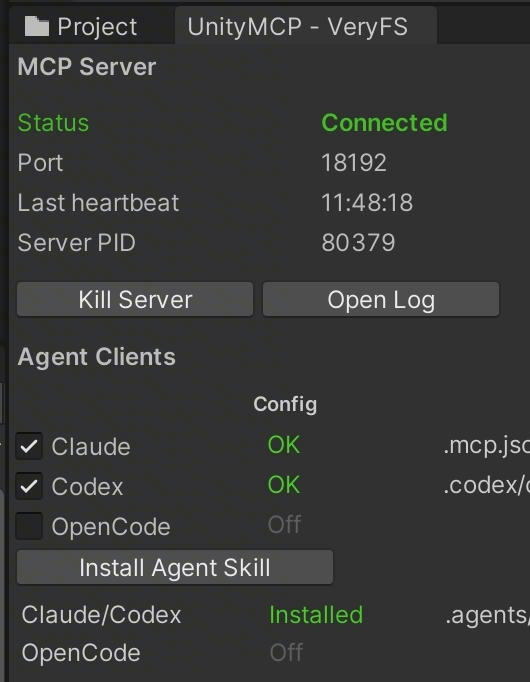

# VeryFS UnityMCP

通过 [Model Context Protocol (MCP)](https://modelcontextprotocol.io) 暴露 Unity Editor 能力，让 AI 直接操作编辑器。完整工具链由 Unity Editor 插件和外部 Go server 两部分组成。

17 个工具：编译反馈、Console 日志、场景与 GameObject 查询、Asset 只读查询、Game View 控制与截图、Test Runner 跑测、FairyGUI 交互闭环、批量执行。UPM 分发，Claude / Codex / OpenCode 一键接入。Unity 2021.3+，Mac / Windows 双平台。

## Requirements

- Unity 2021.3 LTS or later
- [FairyGUI](https://github.com/veryfreestyle/fairygui-upm)
- [LitJson](https://github.com/veryfreestyle/litjson-upm)
- [UniTask](https://github.com/Cysharp/UniTask)

## Installation

<!-- upm-install:begin -->
本分支给「工程自带 FairyGUI / LitJson」的宿主用：`main` 会把 FairyGUI / LitJson 两个 UPM 依赖拉进来，
跟工程里已有的实现撞出重复程序集和 `CS0433`，本分支去掉了它们并把 asmdef 与依赖声明配好。

用 Package Manager 装：`Window > Package Manager` → 左上角 `+` → `Add package from git URL...`，粘贴

```
https://github.com/veryfreestyle/unitymcp-upm.git#hetao-scratch
```

`#hetao-scratch` 不能省，省掉就是 `main` 分支，会把 FairyGUI / LitJson 两个依赖拉进来跟工程里已有的撞车。

或者直接编辑 `Packages/manifest.json`（与上面等价）：

```json
{
  "dependencies": {
    "com.cysharp.unitask": "https://github.com/Cysharp/UniTask.git?path=src/UniTask/Assets/Plugins/UniTask",
    "com.veryfreestyle.unitymcp": "https://github.com/veryfreestyle/unitymcp-upm.git#hetao-scratch"
  }
}
```

FairyGUI 输入注入（`fgui-input` 的键盘 / 文本 / 滚轮 / 手势序列）依赖 fork 版 FairyGUI 的
`IStageInputSource` 等 API。装配期按反射探测：探不到就自动降级成 `click` / `double-click` / `gesture` /
`hover` 四个 action，并在 Console 打一条 compatibility mode warning 写明缺哪个成员。4.3.0 属于降级路径。

> 本分支由主仓的 `sync-unitymcp-upm.sh` 每次同步时自动生成：内容 = `main` 的内容 + 三处兼容性变换
> （`FguiInputWheelCommand.cs`、`VeryFS.UnityMCP.Editor.asmdef`、`package.json`）。
> **不要直接在本分支上手改这三个文件**，下次同步会被覆盖；要改请改主仓或改脚本里的变换。
<!-- upm-install:end -->

### 别用 GitHub 的 Download ZIP 装

`Editor/Server~/` 下的两个 server 二进制（macOS arm64 / Windows x64）在本仓库走 **git-lfs**。GitHub 的
「Download ZIP」和 source tarball 不会还原 lfs 内容，只会给你约 130 字节的 lfs 指针文本文件，文件名对、
内容不对。那样装进项目后 server 根本起不来，症状是 MCP 一直连不上而 Console 只报一个含糊的启动失败。

要拿到真的二进制，用下面任一种：

- **UPM git URL**（上面那段 manifest 的写法）—— Unity 会真的 `git clone`，lfs 内容正常拉取。
- **`git clone`** 本仓库后把目录放进项目的 `Packages/`。

两种都要求本机装了 **git-lfs** 并在 PATH 里（`git lfs version` 能出版本号）。没装的话 clone 出来的
同样是指针文件。装完可以补拉：`git lfs pull`。

## 配置 MCP 客户端

打开 Unity 项目后，UnityMCP 会启动项目本地 MCP server，并按勾选的客户端写入 MCP 配置。

1. 打开 `Window/UnityMCP - VeryFS`，确认 MCP Server 状态为 `Connected`。
2. 在 `MCP Clients` 区域勾选需要配置的客户端。默认启用 `Claude` 和 `Codex`，`OpenCode` 默认关闭，需要时手动开启。



UI 会按勾选项维护这些项目内文件，Unity 每次启动都会重写它们：

- `.mcp.json`（Claude）
- `.codex/config.toml`（Codex）
- `.opencode/opencode.json`（OpenCode）

取消勾选会移除对应文件里的 UnityMCP entry，不动其它配置。这些文件含 client token，应保持 git-ignored。

## MCP 工具一览

Server 通过 `tools/list` 暴露 17 个工具；精确参数、schema 与错误语义以运行时 `tools/list` 为准。

| 分组 | 工具 | 用途 |
|---|---|---|
| 连接与 Editor | `health`、`editor-get-state`、`editor-set-state` | 查看 MCP / Editor 状态，切换 play mode。 |
| 编译与日志 | `assets-refresh`、`console` | 触发 AssetDatabase refresh、读取或清空 Console。 |
| 场景与资源 | `scene`、`gameobject`、`asset` | 打开/保存场景，查询场景对象、组件、AssetDatabase 与 prefab 内容。 |
| Game View | `game-view`、`screenshot-game-view` | 查看/设置 Game View 分辨率、最大化状态并截图。 |
| Test Runner | `test-list`、`test-run`、`test-status` | 发现测试程序集、运行 EditMode / PlayMode 测试、查询运行进度或最终结果。 |
| FairyGUI | `fgui-query`、`fgui-state`、`fgui-input` | 查询 FairyGUI 层级，读写控件状态，走真实输入管线执行指针、键盘、滚轮交互。 |
| 编排 | `batch-execute` | 串行执行多条普通 RPC 子命令，减少多步 UI 自动化往返。 |

### `fgui-input` 的两套 action

`fgui-input` 的 action 集取决于项目装的 FairyGUI 包：

- 装了带输入注入的改造版（`Stage.inputSource` / `StageInputSimulator`）时是 13 个 action：
  `move`、`click`、`double-click`、`press`、`release`、`drag`、`wheel`、`send-key`、`type-text`、
  `step`、`begin-session`、`end-session`、`visualize`。
- 装的是上游原版时自动降级为 4 个：`click`、`double-click`、`gesture`、`hover`，行为与升级前一致。

选择发生在插件装配期，之后不再切换。降级时 Unity Console 会有一条 `compatibility mode` 的
warning 写明缺哪个成员。AI 侧不需要知道装的是哪个包——`tools/list` 里的 action 枚举就是能力声明。

`Pointer speed base (px/s)`、`Wheel scale`、`Input visualizer` 三项在 Server Monitor Window 里按项目配置，
不进工具参数面：AI 永远只给 `speedScale: 1` 和 `delta: 3`，平台与分辨率差异由装它的人调一次。

### `batch-execute` 里调用分组工具

`fgui-input`、`fgui-state`、`fgui-query` 这类分组工具在 `batch-execute` 里 `tool` 字段填的是
rpcMethod（分组工具的 rpcMethod 是组名，如 `fgui.input`，不是 `fgui-input`），实际动作在
`params.action` 里指定。`batch-execute` 本身已经等价于一段隐式的 `fgui-input` session（批
开始时接管指针/键盘，批结束时归还），批内的 `press` / `move` / `release` 等 action 可以直接
串联，不需要再显式开会话。批内仍然可以调这两个 action，只是通常没有意义：`begin-session`
会因为批的会话已经开着而返回 `conflict`；`end-session` 只作用于显式会话——批外先开了显式
会话时它会结束那一个（批自身的隐式会话不受影响，照样活到批尾），没有显式会话时返回
`no_session`。

```json
{
  "commands": [
    {"tool": "fgui.input", "params": {"action": "press", "path": "MainPanel/card"}},
    {"tool": "fgui.input", "params": {"action": "move", "x": 600, "y": 300}},
    {"tool": "screenshot.game-view", "params": {"inlineImage": false}},
    {"tool": "fgui.input", "params": {"action": "release"}}
  ]
}
```

批内穿插截图看拖拽中途是推荐用法，配合 `inlineImage: false` 让返回只剩路径与宽高、避免
base64 埋进聚合 JSON。**批调用本身即使子命令失败也返回成功，必须逐条检查 `results`**，
不能只看外层调用有没有报错。

常用测试流程：先 `assets-refresh`，再用 `test-list` 取程序集名，然后调用 `test-run`。`test-run` 超时只表示 MCP 调用等到上限，不代表测试失败；继续用 `test-status` 读取最终结果。

`screenshot-game-view` 始终把截图文件路径与宽高、字节数作为文本返回；可选参数
`inlineImage` 控制是否附带 base64 内联图片块。省略该参数时按项目级默认值走，默认
值在 Server Monitor 窗口的 **Screenshot / Inline base64 image content** 开关里配置
（存于 `EditorPrefs`，按项目隔离，未配置时为开）——那只是默认值，单次调用传
`inlineImage` 一律以调用为准。关掉内联图片可以显著减少长会话里的 context 占用
（内联进去的图会在会话历史里常驻到结束），需要看图时再单次显式传
`inlineImage: true`，或者按返回的 `path` 自己读文件。

读不了 MCP image content 的 client 应该一律传 `inlineImage: false`，改用返回的
`path` 自己开文件——附带的 base64 对它是纯浪费。工具说明里写的是这个能力条件而
不是具体产品名：能不能吃 image content 随 client 版本变，写死名单会过期。

## FairyGUI UI 自动化测试

FairyGUI 的界面元素是独立的 GObject 树，不挂 GameObject，通用 GameObject 查询无法覆盖。本项目提供专用通道，支持对 FairyGUI 界面做完整的 UI 自动化测试：

- **直接设置状态**：单帧同步设数值、选中项、滚动位置、控制器页码，用于构造断言前置条件。
- **模拟真实操作**：逐帧驱动 press → move → release，走完整事件派发，触发 `onChanged` / `onDragXxx` 等真实回调。
- **读取界面状态**：返回按钮选中态、列表选中项、滑块值、滚动位置等控件语义状态，供断言。

三者构成「构造 → 操作 → 断言」闭环。

## 设计理念

目标是让 AI 在一次指令内完成完整的 TDD 循环：先写测试，确认失败，再实现到通过，全程无需人工介入。一次跑测调用即可取得结果概要与全部失败详情，编译错误以结构化形式返回，FairyGUI 界面同样可写断言。

没有人工复核，每个返回结果都必须能独立采信。

**不产生假通过。** 筛选条件未命中任何用例时直接报错，不接受「零用例、零失败」的结果。测试未通过不等同于调用失败，两者分开返回。

**不以等待推测时机。** 写操作执行完毕即返回，不等待界面动画结束。结果确认由独立的状态查询完成，这些状态在动画开始时即已确定。

**定位方式可复现。** 对象定位只接受名字与路径，不读取编辑器当前选中项。同一指令在不同时间、不同机器上执行，结果一致。

**异常不得导致自锁。** 启动无响应、总时长超限、重连后回调丢失，三种情形均有超时收尾，不会让工具长期停留在「正在跑测试」。断线重连后补发未送达的最终结果。

**写操作先划定边界。** 目标如何定位、能否撤销、失败是否留下半成品、返回后凭什么确认，均需在实现前写明，无法明确者不实现。动态编译执行 C# 代码、读写删除脚本文件默认不提供。

**工具列表保持精简。** 列表越长，选错工具的概率越高，上下文占用也越大。同族操作合并为一个工具，以参数区分具体动作，对外仅暴露十余个。

---

## License

MIT
